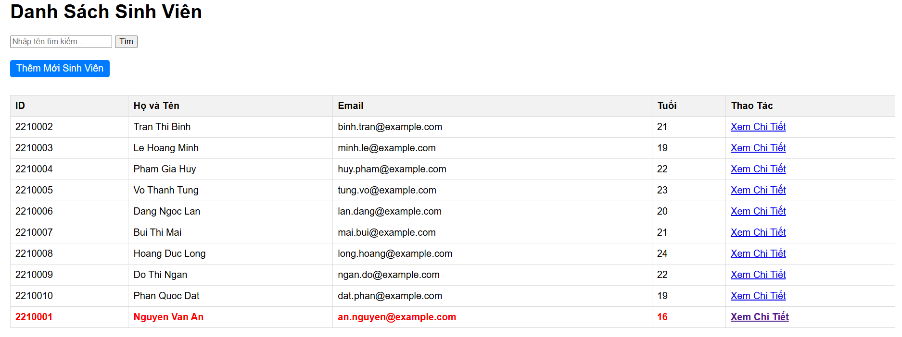
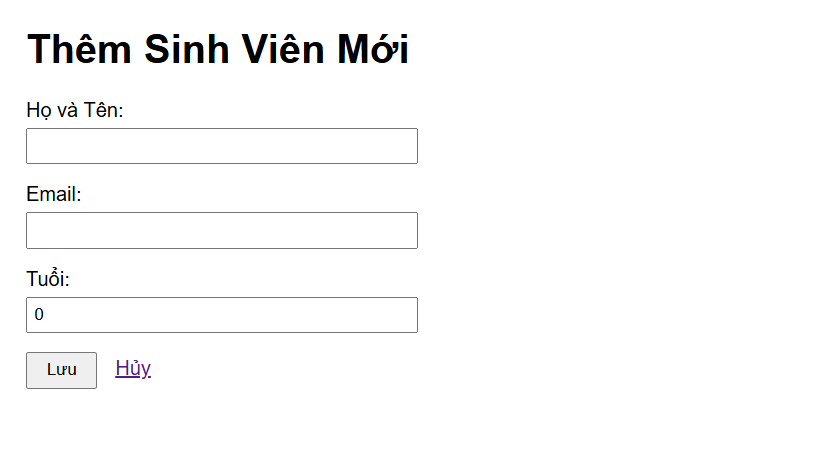
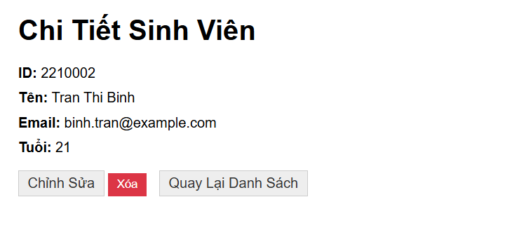
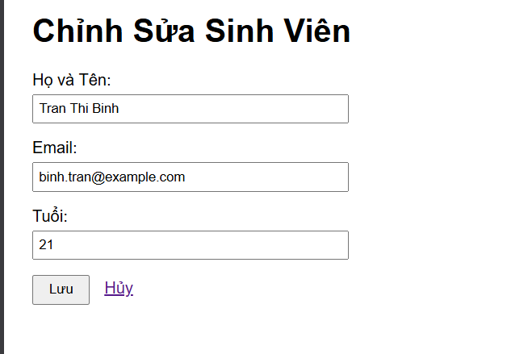
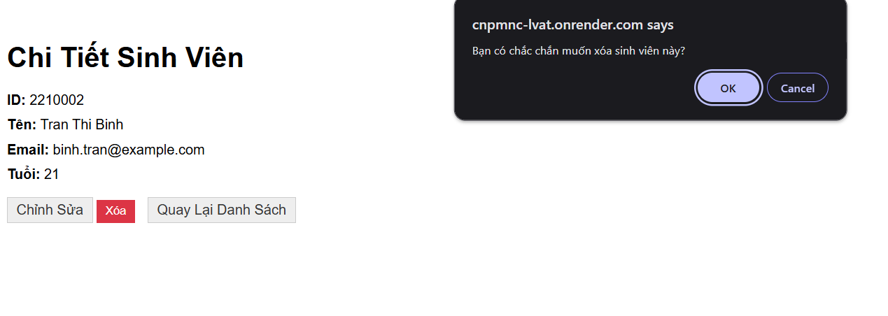
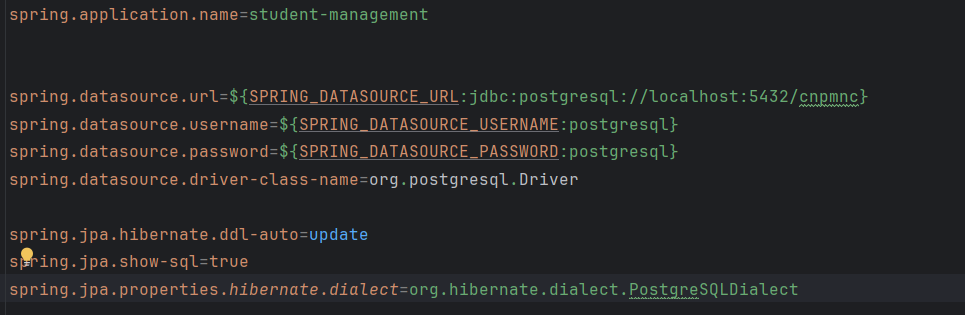
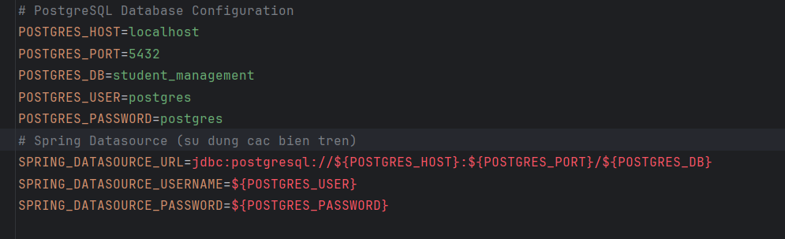

# Lab-1: Quản lý Sinh viên - Công nghệ phần mềm nâng cao

## 1. Danh sách nhóm
- **Họ và tên:** Võ Quang Thắng
- **MSSV:** 2213214

## 2. Public URL (Deployed at Lab 5)
- **URL:** [https://cnpmnc-lvat.onrender.com/students](https://cnpmnc-lvat.onrender.com/students)

## 3. Hướng dẫn chạy dự án
Để chạy dự án này trên máy cá nhân, bạn có thể thực hiện theo một trong hai cách dưới đây:

### Cách 1: Chạy trực tiếp với Maven (Yêu cầu Java 17+ và PostgreSQL)
1. **Clone repository:**
   ```bash
   git clone https://github.com/quangthangk4/cnpmnc
   cd cnpmnc
   ```
2. **Cấu hình Database:**
- Đảm bảo bạn đã cài đặt PostgreSQL và tạo database tên `cnpmnc`. Cập nhật thông tin đăng nhập trong file `src/main/resources/application.properties` nếu cần.
- Nếu sử dụng docker hãy chay lệnh sau để tạo postgres container:
   ```bash
   docker run -d --name postgres-db -p 5432:5432 -e POSTGRES_DB=cnpmnc -e POSTGRES_USER=postgresql -e POSTGRES_PASSWORD=postgresql postgres:latest
   ```
3. **Chạy ứng dụng:**
   ```bash
   ./mvnw spring-boot:run
   ```
4. **Truy cập:** Mở trình duyệt tại [http://localhost:8080/students](http://localhost:8080/students)

### Cách 2: Chạy với Docker Compose (Nhanh nhất - Tự động cài đặt App + DB)
1. **Yêu cầu:** Máy tính đã cài đặt [Docker Desktop](https://www.docker.com/products/docker-desktop/).
2. **Khởi chạy hệ thống:**
   Mở terminal tại thư mục gốc của dự án và chạy lệnh:
   ```bash
   docker compose up -d --build
   ```
   *Lệnh này sẽ tự động build image cho ứng dụng và khởi tạo một container PostgreSQL đi kèm.*
3. **Kiểm tra:** 
   - Ứng dụng: [http://localhost:8080/students](http://localhost:8080/students)
   - Database (nếu cần): localhost:5432 (User: `postgresql`, Pass: `postgresql`)
4. **Dừng hệ thống:**
   ```bash
   docker compose down
   ```

## 4. Trả lời câu hỏi lý thuyết (Lab)
### 1. Lab 1-v2
**câu 2**:  
• Cố tình Insert một sinh viên có id trùng với một người đã có sẵn.  
• Quan sát thông báo lỗi: UNIQUE constraint failed. Tại sao Database lại chặn
thao tác này?
- trả lời: `Khóa chính là độc nhất do đó thao tác thêm một id đã được định nghĩa là khóa chính (PRIMARY KEY) trong câu lệnh tạo bảng sẽ bị chặn. Việc cố tình chèn một id đã tồn tại sẽ vi phạm tính duy nhất (UNIQUE) của cơ sở dữ liệu.`

**câu 3**:  
• Thử Insert một sinh viên nhưng bỏ trống cột name (để NULL).  
• Database có báo lỗi không? Từ đó suy nghĩ xem sự thiếu chặt chẽ này ảnh hưởng gì
khi code Java đọc dữ liệu lên?
- trả lời: `Database sẽ không báo lỗi, bởi vì trong lệnh SQL không có ràng buộc NOT NULL`  
`Ảnh hưởng khi code Java đọc dữ liệu lên: tiềm ẩn rủi ro lớn ở tầng Backend. khi Spring boot truy vấn dữ liệu này lên, thuộc tính name của đối tượng Entity là null. Nếu cố gắng gọi một phương thức thao tác trên chuỗi này (ví dụ: student.getName().toUpperCase()) mà không kiểm tra trước, chương trình sẽ lập tức ném ra lỗi NullPointerException và gây crash luồng xử lý đó.`

**câu 4**:  
• Tại sao mỗi lần tắt ứng dụng và chạy lại, dữ liệu cũ trong Database lại bị mất hết?
- trả lời: `application.properties đang sử dụng cấu hình spring.jpa.hibernate.ddl-auto=create do đó mỗi lần chạy lại ứng dụng hibernate sẽ được drop bảng cũ và tạo lại -> khắc phục: sử dụng update hoặc none`
## 5. Screenshot cho các module (Lab 4)






`application.properties:`


`env: `


---
*Dự án được phát triển dựa trên Spring Boot 4.0.2, PostgreSQL và Thymeleaf.*
